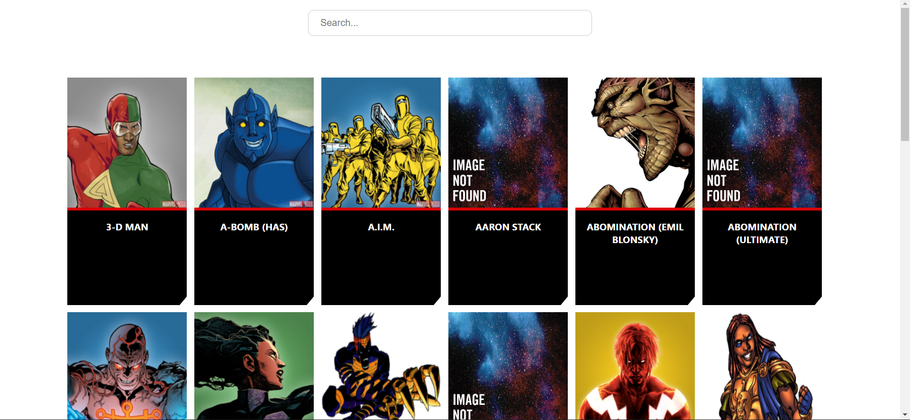
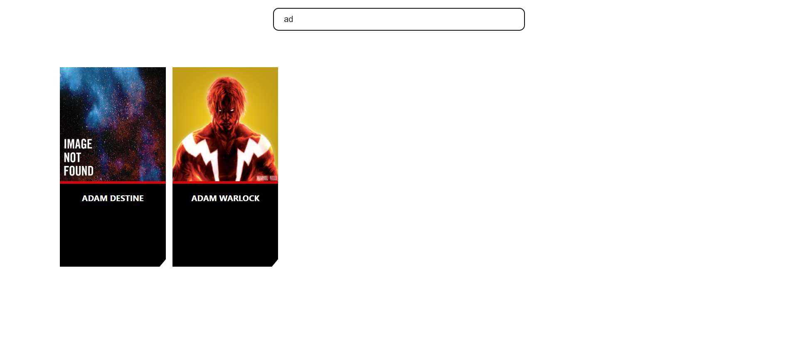

# Marvel Clone
This project is clone of https://www.marvel.com/. It supports limited features for now.
* List 30 characters of marvel.
* Search functionality, you can search the characters among those 30 listed characters.

<h3>Landing Page</h3> 

  
<h3>Search functionality</h3> 

## Dependencies
* Node v14.17.3
* npm 6.14.13

## How to
### Run 
1. Install Node js `https://nodejs.org/en/`
2. To install the dependencies run `npm install`
3. To start the app run `npm start`, it will start the server on `localhost` and port `3000`
4. Open http://localhost:3000 on browser.